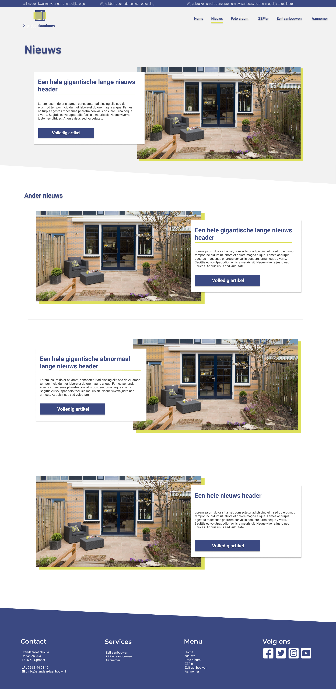
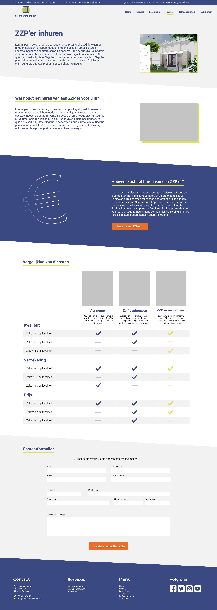

# Standaard Aanbouw Wordpress
In this repository you can find the files used for the Standaard Aanbouw website. In this project Wordpress was used to create a website that was easily usable by the owner and also keep the cost of hosting low. The plugin Advanced Custom Fields was used to create custom styling and flexibility during devlopment. This plugin also gives more control to the owner to edit certain images, titles and text. 

## Where is the website now?
Unfortunatly, due to a big personal project, the owner does not have the time to take on more projects. Therfore the website is offline at the moment. The website was hosted on standaardaanbouw.nl

## Design
There were made multiple designs before the Wordpress development began. The designs were made in Figma and can be viewed here:
### Homepage

### Newspage

### Servicepage

